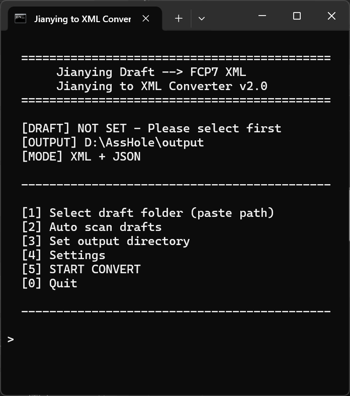
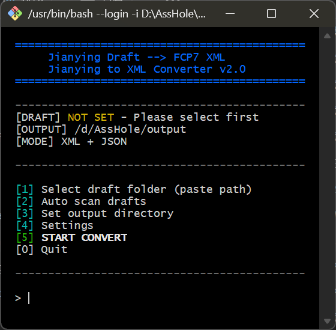

<div align="center">

# CapCut / Jianying Draft to XML Converter

将剪映 / CapCut 工程文件转换为达芬奇 (DaVinci Resolve) 可导入的 FCP7 XML 格式，同时输出结构化 Timeline JSON。

[**English Version**](README_EN.md)



</div>

---

## 目录

- [功能特性](#功能特性)
- [截图](#截图)
- [系统要求](#系统要求)
- [快速开始](#快速开始)
- [使用方法](#使用方法)
- [配置说明](#配置说明)
- [工作原理](#工作原理)
- [支持格式](#支持格式)
- [已知限制](#已知限制)
- [常见问题](#常见问题)
- [致谢](#致谢)
- [开源协议](#开源协议)
- [项目结构](#项目结构)

---

## 功能特性

- **跨平台** — Windows (.bat)、macOS / Linux (.sh)、命令行 (Python)
- **自动扫描** — 自动查找本地剪映 / CapCut 草稿项目
- **双格式输出** — FCP7 XML (导入达芬奇) + Timeline JSON (查看数据)
- **加密兼容** — 剪映 6.x+ 自动回退读取 `template.json` / `template.json.bak` 明文备份
- **零依赖** — 仅使用 Python 标准库，无需安装第三方包
- **多轨支持** — 视频多轨、音频多轨、素材裁剪、变换 (位移/缩放/旋转/透明度)
- **用户配置** — `config.json` 自定义扫描路径和输出设置

---

## 截图

| Windows TUI | macOS / Linux TUI |
|:-----------:|:-----------------:|
|  |  |

---

## 系统要求

| 项目 | 要求 |
|------|------|
| Python | **3.8** 或更高版本 |
| 操作系统 | Windows 10+、macOS 10.15+、Linux (Ubuntu 20.04+) |
| 剪映版本 | 剪映 5.x (明文) 或 剪映 6.x+ (加密，自动回退) |
| CapCut | 国际版 CapCut Desktop 同样支持 |

---

## 快速开始

### Windows

双击 `converter.bat` 即可启动 TUI 交互界面。

```
1. 双击 converter.bat
2. 输入 2 自动扫描草稿
3. 输入编号选择项目
4. 输入 5 开始转换
```

### macOS / Linux

```bash
chmod +x converter.sh
./converter.sh
```

### 命令行 (全平台)

```bash
# 转换草稿 (输出 XML + JSON)
python jianying_to_xml.py "草稿文件夹路径"

# 指定输出目录
python jianying_to_xml.py "草稿路径" -o "./输出目录"

# 仅输出 JSON (不生成 XML)
python jianying_to_xml.py "草稿路径" --json-only
```

### 达芬奇导入

```
DaVinci Resolve → File → Import Timeline → Import AAF, EDL, XML...
→ 选择生成的 .xml 文件
```

---

## 使用方法

### 菜单选项说明

| 选项 | 功能 | 说明 |
|------|------|------|
| `[1]` | 选择草稿路径 | 粘贴完整路径、拖放文件夹到窗口、输入关键词模糊搜索 |
| `[2]` | 自动扫描草稿 | 扫描所有已知剪映 / CapCut 安装路径，列出编号供选择 |
| `[3]` | 设置输出目录 | 4 种方式：保持当前 / 脚本旁 output / 草稿同目录 / 自定义 |
| `[4]` | 转换设置 | 切换「仅 JSON」模式 |
| `[5]` | 开始转换 | 执行转换，完成后列出输出文件并可打开目录 |
| `[0]` | 退出 | 退出程序 |

---

## 配置说明

编辑 `config.json` 可自定义扫描路径和默认行为。

```json
{
  "jianying_projects_dirs": [],
  "output_default": "",
  "auto_open_folder": true
}
```

| 字段 | 类型 | 说明 |
|------|------|------|
| `jianying_projects_dirs` | `string[]` | 自定义的剪映 Projects 根目录列表。为空时使用内置默认路径自动扫描 |
| `output_default` | `string` | 默认输出目录。为空时使用脚本旁 `output/` 文件夹 |
| `auto_open_folder` | `bool` | 转换完成后是否自动打开输出目录 |

### 示例

```json
{
  "jianying_projects_dirs": [
    "E:\\Users\\me\\AppData\\Local\\JianyingPro\\User Data\\Projects"
  ],
  "output_default": "D:\\DaVinci_Projects\\xml_imports",
  "auto_open_folder": false
}
```

---

## 工作原理

```
剪映草稿 (draft_content.json)
    │
    ├─ materials (视频/音频/文字/贴纸/特效/转场)
    │   └─ 素材 ID + 路径 + 时长/分辨率/帧率
    │
    ├─ canvas_config (画布: 分辨率/帧率)
    │
    └─ tracks[] (多轨道时间线)
        ├─ video tracks ──→ FCP7 <video><track>
        ├─ audio tracks ──→ FCP7 <audio><track>
        └─ text/sticker/effect tracks ──→ 仅保留在 JSON
                │
                ▼
    ┌──────────────────────────┐
    │  项目名.xml               │  ← 导入达芬奇
    │  (FCP7 XML / xmeml v5)   │
    │                          │
    │  项目名_timeline.json     │  ← 人读核对数据
    │  (结构化 Timeline 摘要)   │
    └──────────────────────────┘
```

---

## 支持格式

### 转换支持矩阵

| 剪映元素 | XML 转换 | JSON 保留 |
|----------|:--------:|:---------:|
| 视频轨道 (多轨) | ✓ | ✓ |
| 音频轨道 (多轨) | ✓ | ✓ |
| 素材时长 / 起止 | ✓ | ✓ |
| 位置 / 缩放 / 旋转 / 透明度 | ✓ | ✓ |
| 裁剪 (source_timerange) | ✓ | ✓ |
| 倍速播放 | ✓ 平均速度 | ✓ 完整曲线 |
| 音量 | ✓ | ✓ |
| 静音 | ✓ | ✓ |
| 文字轨道 | ✗ | ✓ |
| 贴纸轨道 | ✗ | ✓ |
| 特效 / 滤镜 | ✗ | ✓ |
| 转场 | ✗ | ✓ |
| 关键帧动画 | ✗ | ✓ |

### 输入格式

| 文件 | 说明 |
|------|------|
| `draft_content.json` | 剪映主工程文件 (5.x 明文 / 6.x 加密) |
| `template.json` | 6.x 明文备份 (优先尝试) |
| `template.json.bak` | 6.x 明文备份 (次优先) |
| `draft_content.json.bak` | 旧版明文备份 |
| `draft_meta_info.json` | 项目元数据 (名称等) |

### 输出格式

| 文件 | 格式 | 用途 |
|------|------|------|
| `*.xml` | FCP7 XML (xmeml v5) | 导入 DaVinci Resolve |
| `*_timeline.json` | JSON | 查看 / 核对 Timeline 数据 |

---

## 已知限制

1. **文字 / 贴纸 / 特效 / 转场** — FCP7 XML 标准结构不直接支持这些元素。完整 segment 数据保留在 Timeline JSON 中，可在达芬奇中手动重建。
2. **曲线变速** — XML 中按平均速度输出。原始速度曲线保留在 JSON 中。
3. **关键帧动画** — XML 中不支持。数据保留在 JSON 中。
4. **素材路径** — XML 引用原始绝对路径。素材移动后需在达芬奇中手动 Relink。
5. **剪映 6.x 加密** — `draft_content.json` 已加密，脚本自动回退读取 `template.json` / `template.json.bak`。若备份不存在则无法转换。

---

## 常见问题

### Q: 提示 "Python not found" / "Python 3.8+ not found"

安装 Python 3.8+ 并确保添加到系统 PATH。

- **Windows**: https://www.python.org/downloads/ → 安装时勾选 "Add Python to PATH"
- **macOS**: `brew install python3` 或从官网下载
- **Linux**: `sudo apt install python3 python3-pip` (Ubuntu/Debian)
- **Windows (winget)**: `winget install Python.Python.3.12`

### Q: 剪映 6.x+ 草稿提示 "无法解析 JSON"

脚本会自动尝试 `template.json` → `template.json.bak` → `draft_content.json.bak` 备份文件。如果均不存在，说明草稿从未被剪映 5.x 打开过，目前无法转换。

### Q: 导入达芬奇后素材离线

XML 引用的是原始绝对路径。请使用达芬奇的 Media Management 或手动 Relink 功能定位素材。

### Q: 导入达芬奇后时间线异常

- 确认达芬奇版本 ≥ 15
- 导入时选择 "Use sizing information" 选项
- 确认素材帧率与项目帧率一致

### Q: 如何找到剪映草稿文件夹

剪映菜单 → 草稿列表 → 右键草稿 → 打开文件夹

### Q: 如何支持自定义路径

在 `config.json` 中添加 `jianying_projects_dirs`:

```json
{
  "jianying_projects_dirs": [
    "E:\\MyJianyingData\\Projects"
  ]
}
```

### Q: 自动扫描找不到我的草稿

可能原因：
1. 剪映安装在非标准路径 → 使用 `config.json` 添加自定义路径
2. 草稿在其他磁盘分区 → 脚本会自动扫描 D:/E:/F: 盘 (Windows)
3. Linux 下剪映路径不同 → 在 `config.json` 中配置

---

## 致谢

本项目参考了以下开源项目：

- [JianyingDraft.PY](https://github.com/notinmood/JianyingDraft.PY) — 剪映草稿 Python 操作库
- [pyJianYingDraft](https://github.com/Slihao/JianYingDraft) — 剪映草稿生成工具
- [video-collage-projectfile-maker](https://github.com/zznidar/video-collage-projectfile-maker) — FCP7 XML 生成参考

---

## 开源协议

[MIT License](LICENSE)

---

## 项目结构

```
Jianying-CapCut2XML/
├── jianying_to_xml.py       # 核心转换器
├── converter.bat            # Windows TUI
├── converter.sh             # macOS/Linux TUI
├── find_jianying_drafts.py  # 草稿查找器
├── config.json              # 用户配置
├── sample_draft/            # 测试数据
│   └── draft_content.json
├── screenshot.png           # Windows 界面截图
├── screenshot-sh.png        # macOS/Linux 界面截图
├── README.md                # 中文说明
├── README_EN.md             # 英文说明
└── LICENSE
```
