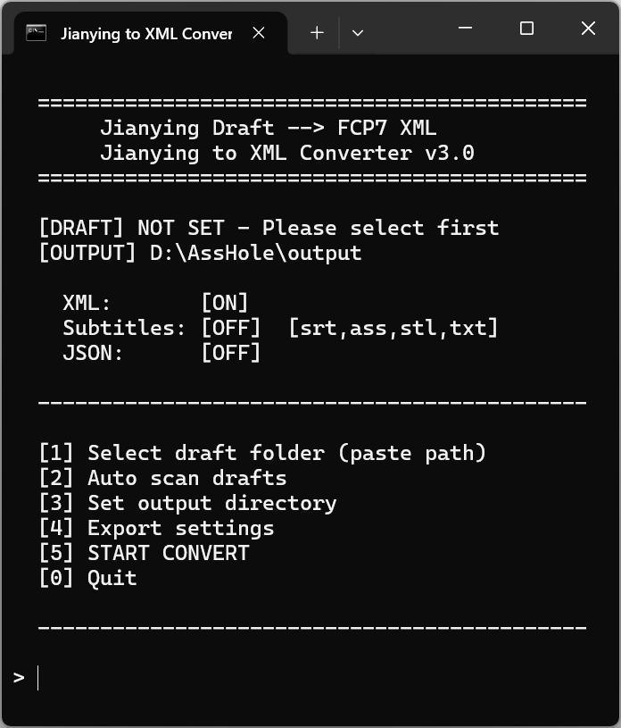
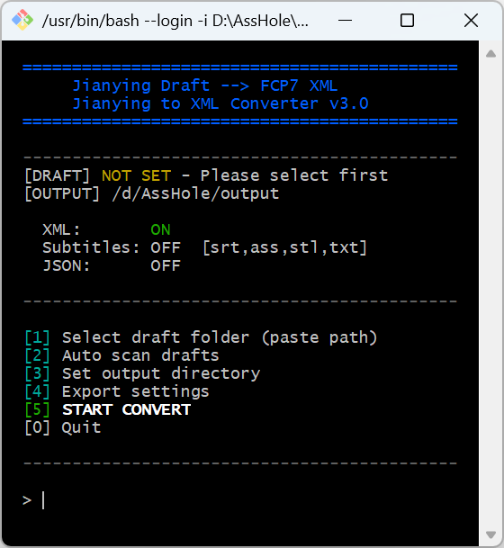

<div align="center">

# CapCut / Jianying Draft to XML Converter

Convert Jianying / CapCut project files to FCP7 XML format for DaVinci Resolve import, with subtitle export (SRT / ASS / STL / TXT) and structured Timeline JSON output.

[**中文版**](README.md)



</div>

---

## Table of Contents

- [Features](#features)
- [Screenshots](#screenshots)
- [Requirements](#requirements)
- [Quick Start](#quick-start)
- [Usage](#usage)
- [Configuration](#configuration)
- [How It Works](#how-it-works)
- [Supported Formats](#supported-formats)
- [Known Limitations](#known-limitations)
- [Troubleshooting](#troubleshooting)
- [Credits](#credits)
- [License](#license)
- [Project Structure](#project-structure)

---

## Features

- **Cross-platform** — Windows (.bat), macOS / Linux (.sh), CLI (Python)
- **Auto-scan** — Automatically finds local Jianying / CapCut draft projects
- **Multi-format output** — FCP7 XML (for DaVinci Resolve) + Subtitles (SRT/ASS/STL/TXT) + Timeline JSON
- **Encrypted support** — Jianying 6.x+ decrypted directly via plugin-core.exe, no plaintext backup needed
- **Transition support** — XML auto-generates `<transitionitem>` (Cross Dissolve / Dip to Black, etc.)
- **Subtitle export** — Standalone subtitle files, text tracks marked as XML markers
- **Keyframe animation** — Scale / Center / Rotation / Opacity keyframes exported to XML
- **Multi-track** — Multiple video/audio tracks, clip trimming, transforms (position/scale/rotation/opacity)
- **User config** — `config.json` for custom scan paths and output settings

---

## Screenshots

| Windows TUI | macOS / Linux TUI |
|:-----------:|:-----------------:|
|  |  |

---

## Requirements

| Item | Requirement |
|------|------------|
| Python | **3.8** or later |
| OS | Windows 10+, macOS 10.15+, Linux (Ubuntu 20.04+) |
| Jianying | Jianying 5.x (plaintext) or 6.x+ (encrypted, decrypted by plugin-core.exe) |
| CapCut | CapCut Desktop (international) also supported |

---

## Quick Start

### Windows

Double-click `converter_v3.bat` to launch the TUI.

```
1. Double-click converter_v3.bat
2. Type 2 to auto scan drafts
3. Type the number to select a project
4. Type 4 to configure export options (XML / Subtitles / JSON)
5. Type 5 to start conversion
```

### macOS / Linux

```bash
chmod +x converter_v3.sh
./converter_v3.sh
```

### Command Line (all platforms)

```bash
# Convert a draft (outputs XML)
python jianying_to_xml_v3.py "/path/to/draft" --xml

# Export subtitles (SRT + ASS + STL + TXT)
python jianying_to_xml_v3.py "/path/to/draft" -f srt,ass,stl,txt

# Export everything (XML + subtitles + JSON)
python jianying_to_xml_v3.py "/path/to/draft" --all -o "./output"

# Export STL subtitle only
python jianying_to_xml_v3.py "/path/to/draft" -f stl
```

### Import to DaVinci Resolve

```
DaVinci Resolve → File → Import Timeline → Import AAF, EDL, XML...
→ Select the generated .xml file
```

---

## Usage

### Menu Options

| Option | Function | Details |
|--------|----------|---------|
| `[1]` | Select draft path | Paste path, drag folder, or type keyword to search |
| `[2]` | Auto scan drafts | Scans all known Jianying / CapCut paths, lists numbered results |
| `[3]` | Set output directory | Keep current / script /output / same as draft / custom path |
| `[4]` | Export settings | Toggle XML / Subtitles (format options) / JSON export modes |
| `[5]` | START CONVERT | Run conversion, list output files, optionally open folder |
| `[0]` | Quit | Exit |

---

## Configuration

Edit `config.json` to customize scan paths and default behavior.

```json
{
  "jianying_projects_dirs": [],
  "output_default": "",
  "auto_open_folder": true
}
```

| Field | Type | Description |
|-------|------|-------------|
| `jianying_projects_dirs` | `string[]` | Custom Jianying Projects root directories. Empty = auto-detect |
| `output_default` | `string` | Default output directory. Empty = use `output/` next to script |
| `auto_open_folder` | `bool` | Auto-open output folder after conversion |

### Example

```json
{
  "jianying_projects_dirs": [
    "E:\\Users\\me\\AppData\\Local\\JianyingPro\\User Data\\Projects"
  ],
  "output_default": "D:\\DaVinci_Projects\\xml_imports",
  "auto_open_folder": false
}
```

---

## How It Works

```
Jianying Draft (draft_content.json, may be encrypted)
    │
    ├─ plugin-core.exe (Go core)
    │   └─ AES-GCM decrypt → materials/tracks/segments/transitions/text/keyframe data
    │
    ├─ tracks[] (multi-track timeline)
    │   ├─ video tracks ──→ FCP7 <video><track> + <transitionitem> + keyframes
    │   ├─ audio tracks ──→ FCP7 <audio><track>
    │   └─ text tracks  ──→ XML markers + SRT/ASS/STL/TXT subtitle files
    │
    └─ Output
        ├─ project_name.xml              ← Import to DaVinci
        ├─ project_name_timeline.json    ← Human-readable data
        ├─ project_name.srt / .ass / .stl / .txt  ← Subtitle files
        └─ project_name_subtitles.*      ← Standalone subtitle export
```

---

## Supported Formats

### Conversion Matrix

| Jianying Element | XML | JSON |
|------------------|:---:|:----:|
| Video tracks (multi) | ✓ | ✓ |
| Audio tracks (multi) | ✓ | ✓ |
| Clip duration / in-out | ✓ | ✓ |
| Position / Scale / Rotation / Opacity | ✓ | ✓ |
| Trim (source_timerange) | ✓ | ✓ |
| Speed (constant) | ✓ (avg) | ✓ (full curve) |
| Volume | ✓ | ✓ |
| Mute | ✓ | ✓ |
| Text tracks | XML markers + SRT/ASS export | ✓ |
| Sticker tracks | ✗ | ✓ |
| Effects / Filters | ✗ | ✓ |
| Transitions | ✓ `<transitionitem>` | ✓ |
| Keyframe animation | ✓ keyframe params | ✓ |

### Input Formats

| File | Description |
|------|-------------|
| `draft_content.json` | Main Jianying project file (5.x plaintext / 6.x encrypted) |
| `template.json` | Plaintext backup (fallback) |
| `template.json.bak` | Plaintext backup (fallback) |
| `draft_content.json.bak` | Legacy plaintext backup |
| `draft_meta_info.json` | Project metadata (name, etc.) |

### Output Formats

| File | Format | Purpose |
|------|--------|---------|
| `*.xml` | FCP7 XML (xmeml v5) | Import to DaVinci Resolve |
| `*_timeline.json` | JSON | Inspect / verify timeline data |
| `*.srt` | SubRip | Universal subtitle format |
| `*.ass` | Advanced SubStation Alpha | Advanced subtitles (with style/position) |
| `*.stl` | EBU STL | Broadcast standard subtitle format (binary) |
| `*.txt` | Plain Text | Plain text subtitles |

---

## Known Limitations

1. **Sticker / Effects / Filters** — FCP7 XML doesn't support these. Full segment data is preserved in Timeline JSON for manual reconstruction in DaVinci.
2. **Text tracks** — Marked as XML markers, independently exported as SRT/ASS/STL/TXT subtitle files. DaVinci doesn't support FCP7 text generators.
3. **Curve speed** — XML outputs average speed. Original speed curve preserved in JSON.
4. **File paths** — XML references original absolute paths. Manual relink needed in DaVinci if media is moved.

---

## Troubleshooting

### Q: "Python not found" / "Python 3.8+ not found"

Install Python 3.8+ and make sure it's added to your system PATH.

- **Windows**: https://www.python.org/downloads/ → Check "Add Python to PATH" during install
- **macOS**: `brew install python3` or download from official site
- **Linux**: `sudo apt install python3 python3-pip` (Ubuntu/Debian)
- **Windows (winget)**: `winget install Python.Python.3.12`

### Q: Can encrypted Jianying 6.x+ drafts be used?

v3 decrypts directly via `plugin-core.exe` (tools/plugin-core.exe), no plaintext backup needed. The TUI auto-locates plugin-core on first use. For CLI mode, use `--plugin-core` to specify the path.

### Q: Media offline after importing to DaVinci

XML references original absolute paths. Use DaVinci's Media Management or manual relink to locate media.

### Q: Timeline looks wrong after import to DaVinci

- Verify DaVinci version ≥ 15
- Check "Use sizing information" during import
- Ensure clip frame rate matches project frame rate

### Q: How to find the Jianying draft folder

Jianying menu → Draft list → Right-click draft → Open folder

### Q: How to use custom paths

Add `jianying_projects_dirs` in `config.json`:

```json
{
  "jianying_projects_dirs": [
    "E:\\MyJianyingData\\Projects"
  ]
}
```

### Q: Auto scan doesn't find my drafts

Possible reasons:
1. Jianying installed at non-standard path → Add custom path in `config.json`
2. Drafts on a different drive → Script auto-scans D:/E:/F: drives (Windows)
3. Different Linux installation path → Configure in `config.json`

---

## Credits

This project references the following open source projects:

- [JianyingDraft.PY](https://github.com/notinmood/JianyingDraft.PY) — Jianying draft Python library
- [pyJianYingDraft](https://github.com/Slihao/JianYingDraft) — Jianying draft generator
- [video-collage-projectfile-maker](https://github.com/zznidar/video-collage-projectfile-maker) — FCP7 XML generation reference

---

## License

[MIT License](LICENSE)

---

## Project Structure

```
Jianying-CapCut2XML/canary/
├── jianying_to_xml_v3.py    # Core converter + subtitle export
├── converter_v3.bat         # Windows TUI
├── converter_v3.sh          # macOS/Linux TUI
├── find_jianying_drafts.py  # Draft finder
├── config.json              # User configuration
├── tools/
│   └── plugin-core.exe      # Go core (encrypted draft decryption)
├── docs/
│   ├── ENCRYPTION_RESEARCH.md   # Jianying encryption research
│   ├── DAVINCI_XML_COMPAT.md    # DaVinci compatibility research
│   └── PLUGIN_CORE_RESEARCH.md  # plugin-core architecture research
├── tests/
│   └── test_xml_validator.py    # XML structure validator
├── sample_draft/            # Test data
│   └── draft_content.json
├── screenshot-v3.png        # Windows TUI screenshot
├── screenshot-v3-sh.png     # macOS/Linux TUI screenshot
├── README.md                # Chinese documentation
├── README_EN.md             # English documentation
└── LICENSE
```
